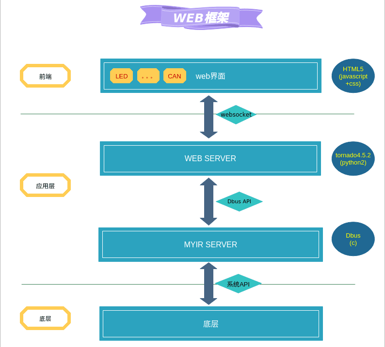

## 1.1 软件框架介绍

如下图，是WEB的软件框架图：

- 1 . 前端界面提供了一些常用的模块，如LED控制、RS232、RS485、CAN等，界面使用CSS开发布局，javascript处理数据的交互
- 2 . 前端通过websocket收发json格式的数据与web后台服务进行通讯，实现模块与后台程序数据交互
- 3 . web后台在与MYIR Server（进程通讯DBUS）通讯，然后调用系统API来控制底层硬件

