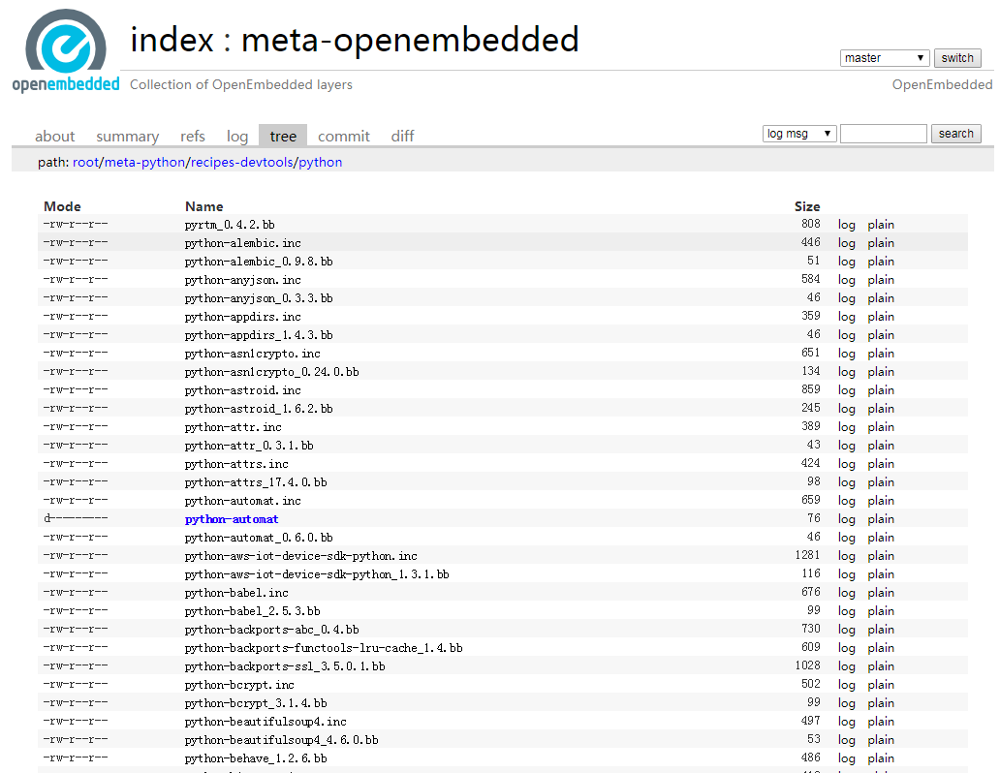
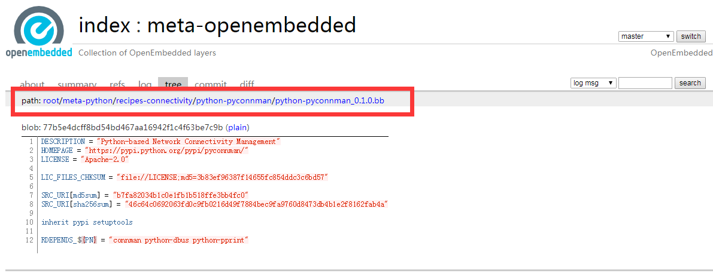
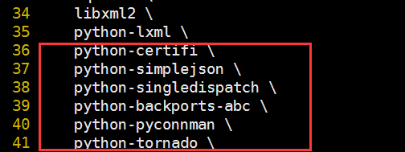
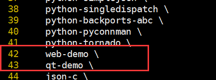

## 1.2 web服务的搭建

web服务是基于我司i.IMX6已经发布资源包基础上进行的搭建的，web server是使用python2作为开发语言，我司的i.IMX6系列开发板的系统也已经提供了python2.6的环境，包含了python基础的库，用户也可以添加自己的需要的库。

&nbsp; &nbsp; &nbsp; &nbsp; &nbsp; &nbsp;
&nbsp; &nbsp; &nbsp; &nbsp; &nbsp; &nbsp;


<br />
<br />
<br />
<br />
<br />

### 1.2.1 添加web用到的一些库

我司提供的web是以python开发，所以需添加的大多是python的库。

提供的web demo需要添加以下库：
- backports_abc-0.5.tar.bz2
- certifi-2017.11.5.tar.bz2
- simplejson-3.8.2.tar.bz2
- singledispatch-3.4.0.3.tar.bz2
- pyconnman-0.1.0.tar.bz2
- tornado-4.5.2.tar.bz2

使用yocto可以很方便的添加相关的库并构建系统，基于meta-openembedded来开发构建，meta-openembedded是openembedded推出的配方大全，如下面的网址，可以查看到官方提供的各种配方库支持文件。
```
http://cgit.openembedded.org/meta-openembedded/tree/meta-python
```
进入上面的网址中选择recipes-devtools/python，可以看到很多的.bb文件




在此可以找到我们需要的文件，名称和版本可能不是完全一致的，官方的资源也是不断更新的，根据实际情况选择，需要注意的是tornado使用的是4.5.2版本，官方的比较新。

 pyconnman-0.1.0.tar.bz2对应的bb文件在recipes-connectivity目录下。

找到这些bb文件后将其下载到yocto源码对应的目录下，yocto源码对应的目录和网址上显示的patch目录也是一致的，如下图红框


拷贝对应的目录，如：
```
fsl-release-yocto/sources/meta-openembedded/meta-python/recipes-connectivity/python-pyconnman/
```

添加支持的bb文件后，在构建系统时就会从官方网络上下载这些需要的库源码，进行交叉编译。
要让这些库交叉编译后整合到文件系统，需修改对应的文件系统bbappend文件,
在执行构建系统时执行此事件，在bb文件中加入如下图的文本，


我司提供了三种文件系统的构建，对应bb文件如下

文件系统 | bb文件 |
---- | ---- | ----
core-image-minimal | core-image-minimal.bbappend
core-image-base | core-image-base.bbappend
fsl-image-qt5 | fsl-image-qt5.bbappend

&nbsp; &nbsp; &nbsp; &nbsp; &nbsp; &nbsp;
&nbsp; &nbsp; &nbsp; &nbsp; &nbsp; &nbsp;
<br />
<br />
<br />
<br />
<br />
<br />
<br />
<br />
<br />
<br />
<br />
<br />
<br />
<br />
<br />

### 1.2.2 构建web demo


#### web demo介绍
web demo的目录结构：

```
.
├── application.py
├── handler
├── README.md
├── server.py
├── statics
└── template

```

启动web服务，执行：
```
python  server.py

```

程序启动时会读取配置文件board_cfg.json，配置文件中定义了RS232、RS485、CAN对应的设备文件节点，dbus的参数，系统性信息、led的信息等，board_cfg.json存放在开发板的/usr/share/myir/目录下，修改次配置文件，web会对应的改变（需重启web服务）。
```
{
        "board_info": {
                "rs232": [
                        "ttymxc1"
                ],
                "rs485": [
                        "ttymxc3"
                ],
                "can": [
                        "can0"
                ],
                "led": [
                        "myc:blue":"cpu0 - D30  - Core Board"
                ],
                "system": {
                        "HMI_version": "MEasy HMI V1.0",
                        "linux_version": "linux-4.1.15",
                        "uboot_version": "u-boot-2016.03",
                        "gcc_version": "arm-linux-gcc 5.3.0",
                        "manufacturer": "MYIR Tech Limited",
                        "board": "MYD-Y6ULX",
                        "CPU": "i.MX6ULL",
                        "memory": "256MB",
                        "storage": "256M"
                }
        },

        "dbus_info": {
                "dbus_name": "com.myirtech.mxde",
                "dbus_path": "/com/myirtech/mxde",
                "dbus_interface": "com.myirtech.mxde.MxdeInterface"
        }
}

```


<br />
<br />
<br />
<br />
<br />
<br />
<br />

#### 基于yocto打包 web demo的程序到系统
Yocto中一个软件包是放在bb文件里的，然后非常多的bb文件集成一个recipe（配方），然后很多的recipe又组成一个meta layer。因此，要加入一个软件包事实上就是在recipe以下加入一个bb（bitbake配置文件）。下面介绍在系统中加入web-demo,
在目录fsl-release-yocto/sources/meta-myir-imx6ulx/recipes-myir下建立如下目录结构：

```
web-demo/
├── web-demo
│   ├── board_cfg.json
│   ├── cJSON.tar.bz2
│   ├── mxde.xml
│   ├── myir
│   └── settings.ini
└── web-demo.bb
```

web-demo.bb是对应执行的事件，主要工作是编译代码然后整合软件到rootfs，以shell为开发语言。

mxde.xml、board_cfg.json、settings.ini是配置文件，程序运行依赖的配置，需要一起打包到文件系统。
myir目录下为web-demo的python代码。
cJSON.tar.bz2是cJSON的库，此处会编译出cJSON的动态库并打包到文件系统。


web-demo.bb的内容如下：
```

DESCRIPTION = "web demo"
DEPENDS = "zlib glibc ncurses "
SECTION = "libs"
LICENSE = "MIT"
PV = "3"
PR = "r0"

PACKAGES = "${PN}-dbg ${PN} ${PN}-doc ${PN}-dev ${PN}-staticdev ${PN}-locale"
PACKAGES_DYNAMIC = "${PN}-locale-*"

SRC_URI = "file://cJSON.tar.bz2;md5sum=580394db958e0edfcd5ca4b25fbedf96 \
           file://myir \
           file://board_cfg.json \
           file://mxde.xml \
           file://settings.ini \
           "

LIC_FILES_CHKSUM = "file://settings.ini;md5=b2e121f7083d25452d0f7168eb7196f9"
S = "${WORKDIR}"

do_compile () {
    make
}

do_install () {
      install -d ${D}/usr/share/myir/
      install -d ${D}/lib/
      cp -S ${S}/*.so*  ${D}/lib/
      cp -r  ${S}/myir/www/  ${D}/usr/share/myir/
      install -m 0755 ${S}/board_cfg.json ${D}/usr/share/myir/
      install -m 0755 ${S}/mxde.xml ${D}/usr/share/myir/
      install -m 0755 ${S}/settings.ini ${D}/usr/share/myir/
}

FILES_${PN} = "/home/myir/ \
               /usr/share/myir/ \
               /usr/share/myir/*/* \
               /lib/ \
              "
```


- SRC_URI  是指定源文件
- LIC_FILES_CHKSUM  是计算md5值
- do_compile、do_install  执行bitbake的方法，编译源码和安装程序到文件系统
- FILES_${PN}  是添加支持的目录


然后还需在构建文件系统时中加入web-demo.bb事件，同上面添加库一样的修改对应文件系统的bbappend文件，如下图：


最后开始构建系统，如：bitbake fsl-image-qt5
<br />
<br />
关于文件系统的构建，可以参考MYD-Y6ULX发布的文档MYD-Y6ULX-LinuxDevelopmentGuide_zh.pdf的3.3章节


