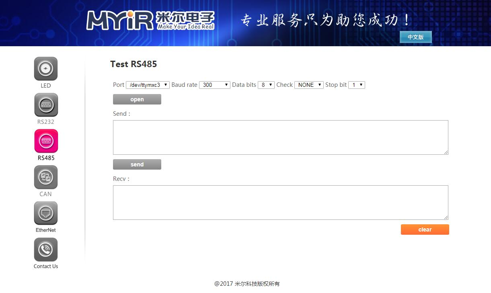

## RS485 测试

本例程演示如何使用 web 配置开发板上的 RS485 并使其发送和接收数据。
将开发板上RS485对应的接口A、B分别与另一个开发板的A、B相连

- 先下拉配置好参数，再点击打开按钮，
- 修改配置参数时会先关闭设备，需要再次打开

- 注意：
   界面中的Port的选项可以在board_cfg.json配置文件修改或添加

硬件：

   开发板 | RS485 |
---- | ---- | ----
MYD-Y6ULX | J10的PIN3、PIN4
MYS-6ULX  | J9

- 界面如下：
- 

