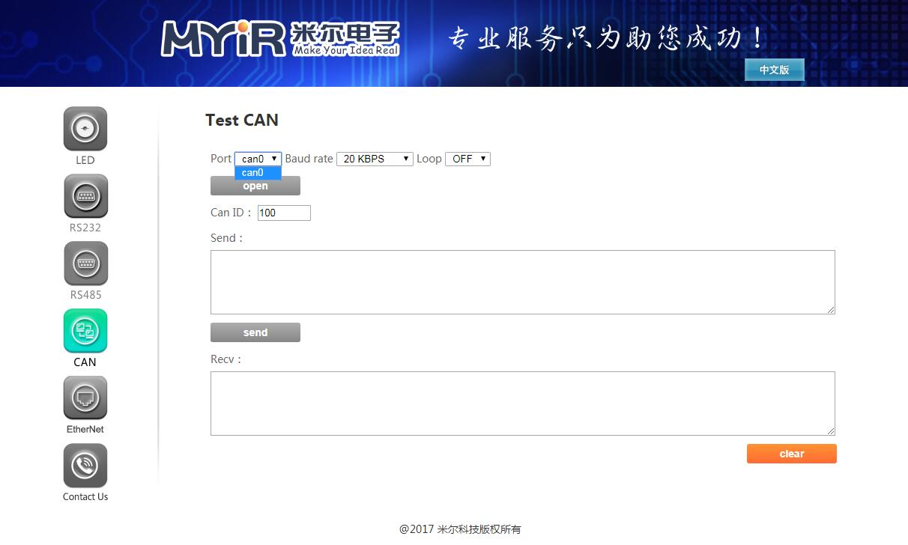

## CAN Bus 测试
- 在页面可以测试开发板的CAN设备,先配置好参数，再打开设备，然后就可以收发数据了。注修改配置参数时会先关闭设备，需要再次打开

本例程演示如何使用 web 配置开发板上的 CAN 并使其发送和接收数据。
将开发板上CAN对应的接口TX、RX、END分别与另一个开发板的RX、TX、END相连

- 先下拉配置好参数，再点击打开按钮，
- 修改配置参数时会先关闭设备，需要再次打开

- 注意：
   界面中的Port的选项可以在board_cfg.json配置文件修改或添加

硬件：

   开发板 | CAN |
---- | ---- | ----
MYD-Y6ULX | J10的PIN3、PIN4
MYS-6ULX  | J13

- 界面如下
- 

