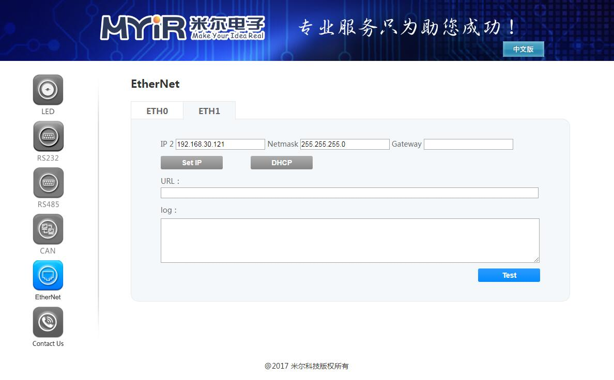

## 网卡测试
- 在页面可以实时的显示网卡状态，也可以修改设置网卡。  修改IP时需要注意，如果修改的是web server使用的网卡，会有提示窗口，确认修改后会修改开发板Ip，web 服务断开，开发板重启。

硬件：

   开发板 | 网卡 |
---- | ---- | ----
MYD-Y6ULX | CN2 ETH2、CN1 ETH1
MYS-6ULX  | CN1 ETH2、CN1 ETH1

- 界面如下：

